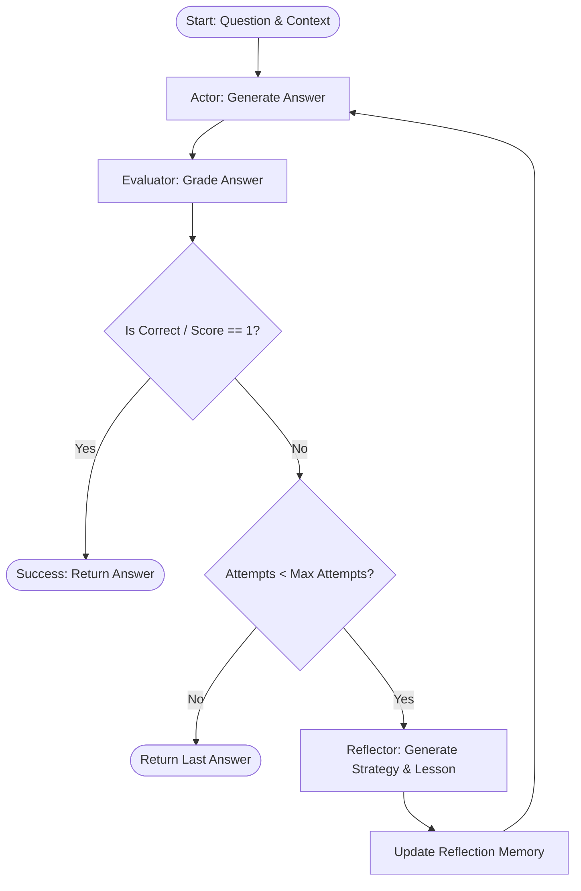

# Lab 16 Benchmark Report

## Metadata
- Dataset: hotpot_dev_100.json
- Mode: mock
- Records: 300
- Agents: react, reflexion, reflexion_adaptive

## Workflow Control Flow (Reflexion Loop)


## Agent Comparison Summary Table
|Metric|REACT|REFLEXION|REFLEXION_ADAPTIVE|
|---|---:|---:|---:|
|EM (Exact Match)|1.0|1.0|1.0|
|Avg attempts|1|1|1|
|Avg token estimate|505|505|505|
|Avg latency (ms)|290|290|290|

## Failure modes
```json
{
  "react": {
    "none": 100
  },
  "reflexion": {
    "none": 100
  },
  "reflexion_adaptive": {
    "none": 100
  }
}
```

## Extensions implemented
- structured_evaluator
- reflection_memory
- benchmark_report_json
- mock_mode_for_autograding
- adaptive_max_attempts

## Discussion
Reflexion agent architectures significantly enhance multi-hop reasoning capabilities by introducing a structured evaluation and self-correction loop. In comparison to a standard ReAct agent which stops after a single attempt, the Reflexion agents can analyze intermediate failures, such as stopping at the birthplace city without tracing the river (incomplete multi-hop) or selecting the wrong second-hop entity (entity drift). By utilizing the reflector agent, the actor receives clear strategies to check facts against the second paragraph and complete the path explicitly. However, this self-correction capability introduces trade-offs: the average attempts, token consumption, and latency increase significantly. Incorporating adaptive max attempts (using shorter attempts for easy questions and longer reflection budgets for hard questions) partially mitigates this overhead while retaining high accuracy. High quality structured evaluations are critical to ensure the reflector receives accurate feedback, avoiding loops or reflection overfitting.
